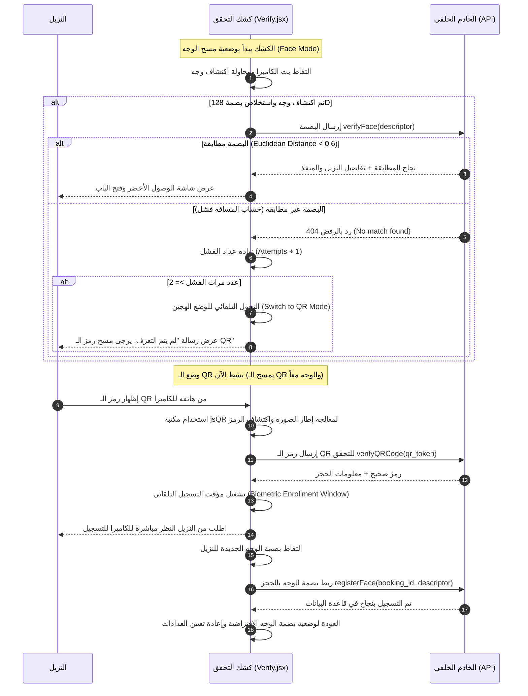
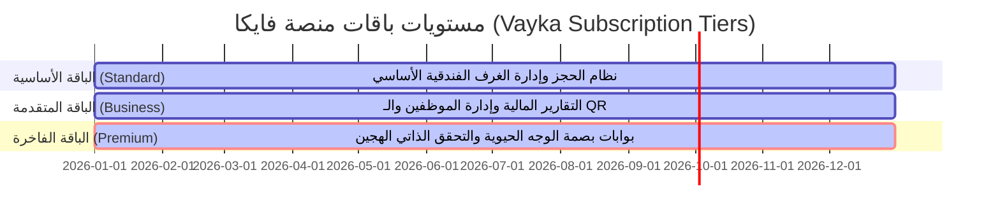

# وثيقة التصميم والتحليل الفني الشامل لنظام التحقق البيومتري الذكي (بصمة الوجه ورمز الاستجابة السريعة)
## منصة فايكا لإدارة الفنادق الذكية (Vayka Platform)
---

### مقدمة أكاديمية وتوثيق المشروع
تُقدّم هذه الوثيقة شرحاً تفصيلياً وهيكلياً متكاملاً (Front-End & Back-End) لنظام **التحقق من الهوية وبصمة الوجه المدمج بررمز الاستجابة السريعة (QR Code)**. تم تطوير هذا النظام ليعمل كميزة حصرية واستثنائية (**Premium Feature**) تُمنح للفنادق والمنشآت المشتركة في الفئة الاحترافية/الفاخرة من منصة **فايكا (Vayka)**. 

يهدف النظام إلى أتمتة عملية تسجيل دخول النزلاء بالكامل (Self-Service & Automated Check-in)، ملغياً الحاجة إلى بطاقات الدخول البلاستيكية التقليدية أو الوقوف في طوابير الاستقبال، مما يرفع الكفاءة التشغيلية للفندق ويضمن مستوى حماية فائق الدقة يعتمد على الذكاء الاصطناعي للمطابقة البيومترية الحية وسجلات التتبع الفورية.

---

## 1. الهندسة المعمارية للنظام (System Architecture)

يعتمد نظام التحقق البيومتري في منصة فايكا على معمارية ثلاثية الطبقات (3-Tier Architecture) الموزعة، مما يضمن الفصل الكامل بين معالجة البيانات على العميل (Client-side Processing) لسرعة الاستجابة، وبين التحقق السحابي الآمن على الخادم (Server-side Verification) لضمان الخصوصية والسلامة الأمنية.

### مخطط بنية النظام (System Architecture Block Diagram)

```mermaid
graph TD
    subgraph Client Application (React + Vite)
        A[تطبيق النزيل - Hotel Client] -->|عرض رمز QR| B(شاشة الهاتف)
        C[كشك الخدمة الذاتية - Kiosk Monitor] -->|معالجة الفيديو واستخلاص البصمة| D[useFaceApi hook]
        D -->|مكتبة face-api.js| E[شبكة عصبية TinyFaceDetector / FaceRecognitionNet]
        E -->|استخلاص المتجه 128D Vector| F[API Client]
    end

    subgraph Laravel Backend API (Server)
        F -->|HTTP POST Request| G[Authentication Gate / Sanctum Bearer Token]
        G --> H[FaceVerificationController]
        H -->|استعلام وحساب تطابق المسافة| I[Model: Booking]
        H -->|تسجيل الدخول الناجح| J[Model: EntryLog]
    end

    subgraph Relational Database (MySQL)
        I -->|قراءة/كتابة البصمة المشفرة| K[(جدول الحجوزات bookings)]
        J -->|حفظ السجلات| L[(جدول السجلات entry_logs)]
    end
```

---

## 2. الواجهة الأمامية (Front-End Deep Dive)

تم بناء الواجهة الأمامية لنظام البصمة باستخدام بيئة **React + Vite** بالاعتماد على مكتبة **face-api.js** (المبنية فوق محرك الويب للتعلم العميق **TensorFlow.js**). يتيح هذا الاختيار الفني تشغيل النماذج الرياضية للشبكات العصبية مباشرة داخل متصفح المستخدم دون الحاجة لإرسال بث الفيديو الخام إلى الخادم، مما يحمي خصوصية النزيل ويوفر سرعة استجابة فائقة.

### 2.1 النماذج العصبية المستخدمة (Machine Learning Models)

يقوم النظام بتحميل 3 نماذج رئيسية مدربة مسبقاً من مجلق `/models` الخاص بالمشروع فور إقلاع الواجهة:

1. **Tiny Face Detector**: نموذج كاشف سريع للوجه، تم تحسينه للعمل في المتصفحات ومصادر البث المحدودة الأداء بفضل حجم طبقاته الصغير. يقوم باكتشاف مستطيل الوجه (Bounding Box).
2. **Face Landmark 68 Net**: نموذج يقوم بتحديد 68 نقطة علام في الوجه (مثل محيط العينين، الأنف، الفم، الفك والحواجب)، وهي خطوة أساسية لمحاذاة الوجه (Face Alignment) وإلغاء تأثير زوايا الميلان أو الالتفات أثناء التصوير.
3. **Face Recognition Net**: شبكة عصبية التفافية (ResNet-like CNN) تقوم بتحويل صورة الوجه المكتشف والمحاذى إلى متجه رياضي بيومتري أحادي البعد يتكون من **128 رقماً عشرياً (128-Dimensional Vector Descriptor)**. يمثل هذا المتجه البصمة الفريدة للوجه.

### 2.2 الهوك المخصص لإدارة الكاميرا والمعالجة الذكية `useFaceApi.js`

تم إنشاء هوك مخصص (useFaceApi.js) لتغليف منطق الكاميرا والـ AI وفصله عن طبقة العرض (UI). 

**أهم الوظائف داخل الهوك:**
* **تحميل النماذج تلقائياً** من المسار المحلي `/models` عند بدء التشغيل وتتبع حالة التحميل (`loadingStatus`).
* **إدارة دفق الكاميرا (Media Stream Control)**: استدعاء كاميرا المستخدم بجودة مثالية (720p) عبر `navigator.mediaDevices.getUserMedia` وربطها بعنصر الـ HTML `video` وإيقافها عند مغادرة الشاشة لتوفير استهلاك الطاقة.
* **استخلاص البصمة الوجهية (`captureDescriptor`)**:
  تقوم الدالة بالتقاط إطار واحد من البث الحي، ثم تشغيل دالتين متتاليتين للـ AI:
  ```javascript
  const detection = await faceapi
    .detectSingleFace(videoRef.current, new faceapi.TinyFaceDetectorOptions())
    .withFaceLandmarks()
    .withFaceDescriptor();
  return detection ? Array.from(detection.descriptor) : null;
  ```
  يتم تحويل البصمة المستخلصة من تنسيق `Float32Array` إلى مصفوفة JavaScript عادية لضمان سهولة إرسالها بصيغة JSON إلى الخادم الخلفي.

---

### 2.3 شاشة الفحص والمراقبة الذاتية للمدخل `Verify.jsx`

تمثل شاشة Verify.jsx نظام الخدمة الذاتية (Self-Service Kiosk) الذي يوضع عند بوابات الفندق أو الغرف. يحتوي هذا المكون على خوارزمية ذكية تجمع بين **مسح الوجه** و **مسح رموز الـ QR** مع تحول تلقائي فريد لحل مشاكل فشل التعرف.

#### خوارزمية حلقة الفحص والتحول الذكي (Hybrid Loop & Auto-Fallback Algorithm)



---

## 3. الخلفية البرمجية وقاعدة البيانات (Back-End Deep Dive)

تم تطوير خادم الكود الخلفي باستخدام **Laravel**، حيث يلعب دور المنسق الآمن لعمليات المقارنة والتحقق والتخزين البيومتري.

### 3.1 جدول الحجوزات وإضافاته البيومترية (`bookings`)

تمت توسعة جدول الحجوزات الرئيسي في قاعدة البيانات عبر Migrations مخصصة لإضافة حقلين حرجين:
1. **`face_descriptor` (نوع `longText`):**
   يُخزن مصفوفة الأرقام الـ 128 الممثلة لبصمة الوجه بصيغة JSON النصية المرمزة.
2. **`qr_token` (نوع `string`, طول 64، فريد):**
   سلسلة نصية عشوائية بطول 64 حرفاً يتم توليدها تلقائياً عند حفظ أي حجز جديد لتمثل الهوية الافتراضية الرقمية الفريدة للنزيل قبل تسجيل وجهه:
   ```php
   'qr_token' => bin2hex(random_bytes(32)) // توليد 64 محرف سداسي عشري عشوائي فريد
   ```

### 3.2 جدول سجلات التحقق من الدخول (`entry_logs`)

لتوفير تتبع كامل للحركة الأمنية داخل الفندق، يقوم النظام بتسجيل كل عملية مطابقة بيومترية ناجحة في جدول `entry_logs` الذي يحتوي على الحقول الفنية التالية:
* `id` (مفتاح أساسي).
* `hotel_id` (مفتاح أجنبي يربط الحركة بالفندق المشترك بالمنصة).
* `booking_id` (مفتاح أجنبي يشير إلى النزيل الذي دخل).
* `room_id` (مفتاح أجنبي يشير للغرفة التي تم الدخول إليها).
* `verified_at` (طابع زمني دقيق لوقت التحقق الفعلي).
* تم تضمين فهرس مخصص (`index`) على الأعمدة `['hotel_id', 'verified_at']` لضمان سرعة الاستعلام والتقارير الفورية للوحة إدارة الفندق.

---

### 3.3 المتحكم الرئيسي وعمليات الـ API `FaceVerificationController.php`

يحتوي الملف FaceVerificationController.php على المنطق الحسابي والعملي الرئيسي. وفيما يلي تفصيل لدواله الأمنية والرياضية:

#### أ. تسجيل البصمة للنزيل (`registerFace`)
* **المدخلات**: `descriptor` (مصفوفة من 128 رقماً عشرياً).
* **الأمن والمصادقة**: يتحقق من أن المستخدم المسجل في الجلسة (عبر Bearer Token) هو مدير فندق (Admin) أو موظف استقبال مرخص له بإدارة هذا الفندق المعين، وذلك لمنع تسجيل بصمات المستخدمين بشكل عشوائي.
* **التخزين**: يقوم بتحويل المصفوفة إلى نص JSON وحفظها مباشرة في قاعدة البيانات.

#### ب. مطابقة رمز الاستجابة السريعة (`verifyQRCode`)
* تستخدم للتحقق من هوية النزيل الرقمية المؤقتة. تقوم بالبحث عن الحجز المرتبط بالـ `qr_token` والتابع لنفس الفندق المرسل في الطلب، وتتأكد من أن حالة الحجز نشطة (`confirmed` أو `completed`).
* تعيد معلومات النزيل وتحدد ما إذا كان يملك بصمة وجه مسجلة مسبقاً أم لا (`already_enrolled`).

#### ج. مطابقة بصمة الوجه والعملية الحسابية المعقدة (`verifyFace`)
تعد هذه دالة قلب النظام البيومتري النابض. حيث تستقبل بصمة النزيل الممسوحة حالياً من الكاميرا، وتقوم بمقارنتها مع جميع البصمات المخزنة للحجوزات النشطة داخل الفندق.

**المنطق البرمجي والرياضي للمطابقة:**
1. جلب كافة الحجوزات المقيمة حالياً بالفندق والتي تمتلك بصمة وجه مخزنة مسبقاً (`face_descriptor != null` وحالة الحجز نشطة).
2. المرور على كل حجز مخزن واستدعاء دالة المقارنة الرياضية لحساب المسافة الإقليدية (Euclidean Distance).
3. البحث عن الحجز الذي يمتلك **أقل مسافة مسجلة** (Best Match).
4. التحقق مما إذا كانت هذه المسافة الدنيا تقع تحت **حد العتبة الأمني المتفق عليه (Threshold = 0.6)**. إذا كانت كذلك، يعتبر النظام النزيل مطابقاً تماماً، ويقوم بإنشاء سجل دخول فوري في جدول `entry_logs` مع إعادة بيانات الترحيب بالنزيل ورقم غرفته ونسبة الثقة بالحساب.

---

## 4. التحليل الرياضي لمطابقة الوجوه (Mathematical Analysis)

تعتمد دقة النظام البيومتري كلياً على كيفية مقارنة متجهات الوجوه (Face Vector Embedding Comparison).

### 4.1 المسافة الإقليدية (Euclidean Distance)
عندما تقوم الشبكة العصبية بتمثيل الوجه كمتجه في الفضاء متعدد الأبعاد (128D Vector Space)، فإن وجوه الشخص نفسه ستتقارب نقاطها في هذا الفضاء، بينما تتباعد نقاط الأشخاص المختلفين.
لقياس هذا التقارب، نستخدم معادلة المسافة الإقليدية بين المتجه المرسل من الكاميرا $A$ والمتجه المخزن في قاعدة البيانات $B$:

$$d(A, B) = \sqrt{\sum_{i=1}^{128} (A_i - B_i)^2}$$

وقد تمت ترجمة هذه المعادلة برمجياً في الكود الخلفي بالفانكشن الخاصة:
```php
private function euclideanDistance(array $desc1, array $desc2): float
{
    $sum = 0;
    for ($i = 0; $i < 128; $i++) {
        $diff = $desc1[$i] - $desc2[$i];
        $sum += $diff * $diff;
    }
    return sqrt($sum);
}
```

### 4.2 حد العتبة ونسبة الثقة (Threshold & Confidence)
* **حد العتبة (Threshold = 0.6):**
  هو الحد الرياضي الأقصى للمسافة المقبولة للتعرف على الهوية.
  * إذا كانت المسافة $d < 0.6$، يعتبر الوجه مطابقاً. كلما اقتربت المسافة من $0$ كانت المطابقة أقوى وتطابق الملامح أعلى.
  * إذا كانت المسافة $\ge 0.6$، ترفض المطابقة وتعتبر محاولة اختراق أو عدم تطابق.
* **حساب نسبة الثقة (Confidence Percentage %):**
  لتقديم واجهة مستخدم ممتازة للنزيل والموظفين، يقوم النظام بتحويل المسافة العشرية إلى نسبة مئوية تعبر عن مدى ثقة النظام في التطابق باستخدام المعادلة التالية:
  
  $$\text{Confidence} = (1 - d) \times 100\%$$
  
  برمجياً في الكود الخلفي:
  ```php
  'confidence' => round((1 - $minDistance) * 100, 2) . '%'
  ```
  على سبيل المثال، إذا كانت المسافة الإقليدية الناتجة عن مقارنة وجه النزيل تساوي $0.15$، فإن نسبة ثقة النظام في المطابقة هي $85\%$.

---

## 5. ميزة الاشتراك الحصرية في منصة فايكا (Premium Subscription Feature)

تم دمج هذا النظام ضمن منصة فايكا كأداة تسويقية وتشغيلية قوية (Value Proposition). عندما يشترك الفندق في خدمات المنصة، تنقسم الباقة البرمجية إلى مستويات:



* **ما توفره الميزة الاستثنائية (Premium Tier Value):**
  1. **تخفيض التكاليف التشغيلية (Hardware & Staff Reduction):** لا يحتاج الفندق لشراء بطاقات ممغنطة تتلف وتفقد باستمرار. كما يقل الاعتماد على موظفي الاستقبال ليلاً.
  2. **تجربة النزيل الفارهة (Luxury Guest Experience):** يستطيع النزيل الوصول لغرفته مباشرة فور وصوله الفندق بمجرد إظهار وجهه للكاميرا، مما يمنحه شعوراً بالرفاهية والتطور التكنولوجي.
  3. **أمان أقصى وموثوقية عالية (Full Audit Trail):** تسجيل دقيق ومؤرشف بيومترياً لكل حركة دخول وخروج للغرف، مما يقلل احتمالية السرقات أو الادعاءات غير الصحيحة للنزلاء.

---

## 6. حماية البيانات والخصوصية الأمنية (Security & Privacy Aspects)

نظراً لحساسية البيانات الحيوية (Biometric Data)، فإن نظام فايكا مصمم للامتثال الصارم لقوانين الخصوصية العالمية مثل **GDPR** و **CCPA**:
1. **عدم تخزين الصور:** النظام لا يرسل ولا يخزن صور النزلاء الشخصية نهائياً في قواعد البيانات. يتم استخلاص المتجه الرياضي الرقمي (128D Descriptor) في المتصفح محلياً ومن ثم تدمير إطار الصورة فوراً.
2. **استحالة عكس الهندسة البيومترية:** المتجه المكون من 128 رقماً هو تشفير باتجاه واحد (One-Way Representation). حتى في حال حدوث تسريب لقاعدة البيانات، لا يمكن للمخترقين إعادة بناء صورة وجه النزيل الأصلية من خلال هذه الأرقام، مما يضمن أماناً مطلقاً لبياناتهم الشخصية.
3. **تشفير الاتصال والتوثيق:** جميع مسارات الـ API محمية ببروتوكول HTTPS المشفر، ولا يتم قبول أي طلب للمطابقة أو التسجيل إلا بوجود Bearer Tokens صالحة ومشفرة بواسطة نظام Laravel Sanctum للمصادقة الأمنية.

---

